# 뿌요뿌요 퍼즐 게임 (C++)

## 프로젝트 개요

현대적인 C++ 언어와 SDL3 라이브러리를 활용하여 개발한 뿌요뿌요 스타일의 퍼즐 게임입니다. 최신 C++ 기능과 SDL3 라이브러리를 활용하여 네트워크 대전이 가능한 완전한 기능의 퍼즐 게임입니다.

## 핵심 기능

- **P2P 네트워크 대전**: 한 사용자가 서버 역할을 하고 다른 사용자가 클라이언트가 되어 실시간으로 대전할 수 있습니다.
- **현대적인 C++ 활용**: C++11부터 C++20까지의 최신 언어 기능(개념, 스마트 포인터, 람다, 템플릿 등)을 적극 활용하였습니다.
- **SDL3 라이브러리**: 최신 SDL3 라이브러리를 활용한 그래픽, 입력, 오디오, 네트워크 처리를 구현하였습니다.
- **게임 상태 관리**: 로그인, 방 선택, 캐릭터 선택, 게임 진행 등 다양한 상태를 체계적으로 관리합니다.
- **시각적 효과**: 파티클 시스템, 애니메이션, 다양한 배경을 통해 풍부한 시각적 경험을 제공합니다.
- **효율적인 리소스 관리**: 텍스처, 폰트 등의 리소스를 효율적으로 관리합니다.

### 스크린샷

#### 로그인 화면

#### 룸 화면

#### 캐릭터 선택 화면

#### 게임 결과 화면

## 데모 영상

## 기술 스택

- **언어**: C++17/C++20
- **그래픽/입출력**: SDL3, SDL_Image, SDL_TTF
- **네트워킹**: Windows Socket API (IOCP 비동기 I/O)
- **빌드 시스템**: Visual Studio 2022
- **디자인 패턴**: 싱글톤, 상태, 팩토리, 관찰자, 커맨드 패턴 등

## 시스템 아키텍처

다음 다이어그램은 게임의 전체 아키텍처를 보여줍니다:

## 프로젝트 구조

### 핵심 모듈

- **Core**: 게임의 기본 구조와 매니저 시스템
- **Managers**: 리소스, 상태, 플레이어 등을 관리하는 매니저 클래스들
- **States**: 게임의 다양한 상태(로그인, 방, 캐릭터 선택, 게임)를 관리
- **Network**: P2P 네트워크 통신을 위한 클라이언트/서버 구현
- **Game**: 블록, 플레이어, 배경 등 게임 객체 구현
- **UI**: 버튼, 레이블, 텍스트 입력 등 사용자 인터페이스 요소
- **Effects**: 파티클 효과 및 애니메이션 시스템
- **Utils**: 타이머, 로거, 경로 관리 등 유틸리티 기능

### 모듈 구조도

```mermaid
classDiagram
    %% Core 모듈
    class Core_GameApp
    class Core_IManager
    class Core_IResource
    class Core_IRenderable
    class Core_IEventHandler
    class Core_Managers

    %% Managers 모듈
    class Managers_ResourceManager
    class Managers_StateManager
    class Managers_FontManager
    class Managers_MapManager
    class Managers_PlayerManager
    class Managers_ParticleManager

    %% States 모듈
    class States_BaseState
    class States_LoginState
    class States_RoomState
    class States_CharacterSelectState
    class States_GameState

    %% Network 모듈
    class Network_Controller
    class Network_Server
    class Network_Client
    class Network_PacketProcessor
    class Network_PacketBase

    %% Game 모듈
    class Game_Block
    class Game_IceBlock
    class Game_GroupBlock
    class Game_GameGroupBlock
    class Game_BasePlayer
    class Game_LocalPlayer
    class Game_RemotePlayer
    class Game_RenderableObject
    class Game_AnimatedObject

    %% Background 모듈
    class Game_Background
    class Game_GrasslandBG
    class Game_IcelandBG
    class Game_ParticleSystem

    %% UI 모듈
    class UI_Button
    class UI_Label
    class UI_TextBox
    class UI_EditBox

    %% Textures 모듈
    class Textures_ImageTexture
    class Textures_StringTexture

    %% Effects 모듈
    class Effects_Particle
    class Effects_ParticleContainer
    class Effects_ExplosionEffect

    %% Utils 모듈
    class Utils_Timer
    class Utils_Logger
    class Utils_PathUtil

    %% 주요 관계
    Core_GameApp --> Core_Managers
    Core_IManager <|-- Managers_ResourceManager
    Core_IManager <|-- Managers_StateManager
    Core_IManager <|-- Managers_FontManager
    Core_IManager <|-- Managers_MapManager
    Core_IManager <|-- Managers_PlayerManager
    Core_IManager <|-- Managers_ParticleManager

    States_BaseState <|-- States_LoginState
    States_BaseState <|-- States_RoomState
    States_BaseState <|-- States_CharacterSelectState
    States_BaseState <|-- States_GameState

    Managers_StateManager --> States_BaseState

    Game_RenderableObject <|-- Game_AnimatedObject
    Game_RenderableObject <|-- Game_Block
    Game_Block <|-- Game_IceBlock
    Game_RenderableObject <|-- Game_GroupBlock
    Game_GroupBlock <|-- Game_GameGroupBlock

    Core_IRenderable <|-- Game_RenderableObject
    Core_IRenderable <|-- UI_Button
    Core_IRenderable <|-- UI_Label
    Core_IRenderable <|-- UI_TextBox

    UI_TextBox <|-- UI_EditBox

    Core_IResource <|-- Textures_ImageTexture
    Textures_ImageTexture <|-- Textures_StringTexture

    Game_BasePlayer <|-- Game_LocalPlayer
    Game_BasePlayer <|-- Game_RemotePlayer

    Game_Background <|-- Game_GrasslandBG
    Game_Background <|-- Game_IcelandBG

    Effects_Particle <|-- Effects_ExplosionEffect
```

### 주요 클래스

- **GameApp**: 싱글톤 패턴으로 구현된 게임 메인 클래스
- **StateManager**: 게임 상태 전환 및 관리
- **NetworkController**: 네트워크 통신 제어
- **BasePlayer/LocalPlayer/RemotePlayer**: 로컬 및 원격 플레이어 구현
- **Block/GroupBlock**: 게임 내 블록 및 블록 그룹 관리
- **GameBackground**: 다양한 배경 효과 및 파티클 렌더링

## 게임 플레이 흐름

## 네트워크 구현

- **패킷 기반 통신**: 다양한 게임 이벤트(블록 이동, 회전, 공격 등)를 패킷으로 주고받음
- **비동기 I/O**: IOCP(I/O Completion Port)를 활용한 효율적인 네트워크 처리
- **P2P 구조**: 한 플레이어가 서버 역할, 다른 플레이어가 클라이언트 역할 수행
- **패킷 처리기**: 각 패킷 타입별 전용 프로세서로 모듈화된 패킷 처리

## 설치 및 실행 방법

1. **요구 사항**:

   - Visual Studio 2022
   - SDL3 라이브러리
   - Windows 10 이상

2. **빌드 방법**:

   - 프로젝트를 Visual Studio 2022에서 열기
   - 필요한 SDL3 라이브러리 설치
   - 솔루션 빌드 (Release 모드 권장)

3. **실행 방법**:
   - 생성된 실행 파일 실행
   - 서버로 시작하려면 "Create Server" 버튼 클릭
   - 클라이언트로 접속하려면 서버 IP 입력 후 "Connect" 버튼 클릭

## 설계 결정 및 패턴

- **상태 패턴**: 게임의 다양한 화면과 상태 전환을 관리하기 위한 상태 패턴 적용
- **매니저 시스템**: 리소스, 상태, 플레이어 등을 관리하는 매니저 클래스를 통해 모듈성 확보
- **팩토리 메서드**: 다양한 게임 객체(블록, 파티클 등)의 생성을 담당하는 팩토리 메서드 패턴
- **관찰자 패턴**: 이벤트 처리를 위한 관찰자 패턴 적용 (이벤트 리스너 인터페이스)
- **컴포넌트 기반**: 렌더링, 이벤트 처리 등의 기능을 컴포넌트 형태로 분리하여 재사용성 확보

## 향후 개선 사항

- 크로스 플랫폼 지원 (Linux, MacOS)
- 온라인 랭킹 시스템 구현
- 추가 게임 모드 및 특수 블록 구현
- 모바일 플랫폼 지원
- 게임 리플레이 기능 추가

## 참고 링크

### 사용된 라이브러리

- SDL3: [GitHub](https://github.com/libsdl-org/SDL) | [공식 홈페이지](https://www.libsdl.org/)
- SDL 언어 바인딩: [SDL 지원 언어 목록](https://www.libsdl.org/languages.php)
- SDL_Image: [GitHub](https://github.com/libsdl-org/SDL_image)
- SDL_TTF: [GitHub](https://github.com/libsdl-org/SDL_ttf)

### 학습 자료

- [SDL 위키](https://wiki.libsdl.org/)
- [SDL 포럼](https://discourse.libsdl.org/)

## 라이선스

이 프로젝트는 개인 포트폴리오용으로 작성되었으며, 상업적 용도로 사용하지 않습니다.
원본 뿌요뿌요 게임의 저작권은 SEGA에 있습니다.
